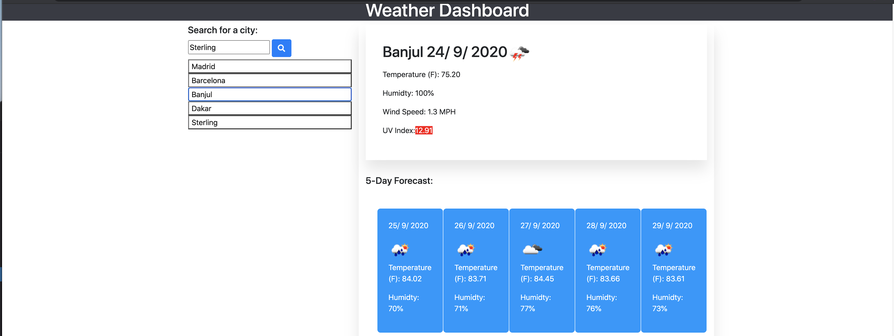

# Weather-Dashboard
This an application that allows the user to search the name of a city and get the current weather information for that city and also the weather information for the upcoming days. The user can also click on the search history to get the weather information of the cities they have already searched. I used the two API's,  both from open weather API which allows me to get the coordinates of the city searched and then I use those coordinates to display the weather information for that city. The UV index gets a different color depending how severe it is.

